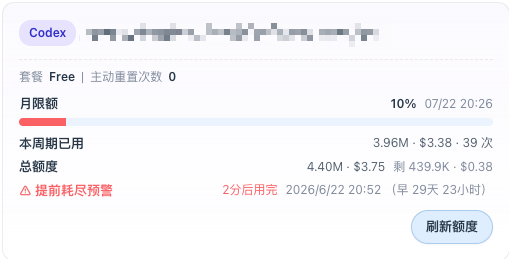
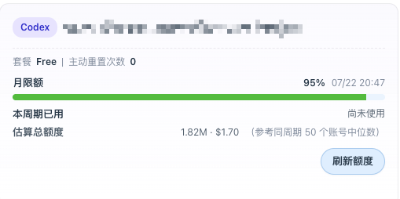

# CPA Codex Helper

> Enhance [CPA-Manager-Plus](https://github.com/seakee/CPA-Manager-Plus) Codex quota display: cycle usage, total-limit inference, remaining-quota estimate, early-exhaustion warning.

[简体中文](./README.zh-CN.md) | English

A userscript for self-hosted CPA-Manager-Plus frontends. The script does not touch any backend data — it reuses the page's own requests and authorization info in the browser to add clearer usage, limit, and prediction info to Codex quota cards.

## Screenshots

### Card with usage

For accounts that have consumed this cycle, the script adds three rows under the original card: cycle usage, inferred total limit, and an early-exhaustion warning.



### Card without usage

For accounts that have not been used this cycle, the script shows "Not used yet" and an estimated limit based on the median of active accounts in the same cycle window.



### Aggregate summary

A chip next to the "Codex 额度" section title shows the combined view across all accounts: used / total tokens & cost, usage percentage (color-coded at 30% / 70%), estimated-account count, and a predicted exhaustion time when applicable.


## Features

### Per-card enhancement

Each Codex account card gains:

- **Used this cycle**: token count, cost, request count (not provided by the original card)
- **Total limit**: inferred from Codex's reported `used_percent` and analytics-aggregated usage
- **Remaining**: total minus used
- **Early-exhaustion warning**: shown with the predicted exhaustion time when the current pace would exhaust the quota before the cycle ends

### Estimate for unused accounts

For accounts with no consumption this cycle:

- **Estimated limit**: median of inferred limits from accounts with real usage in the same cycle window
- Annotated with "median of N same-cycle accounts" so the confidence is visible

### Section header aggregate

A chip at the Codex section title shows the merged view of all accounts:

- Used / total (including estimated contributions)
- Usage percentage, color-coded at 30% / 70% thresholds
- Active account count + estimated account count
- Predicted exhaustion time based on the combined consumption rate (shown only when earlier than cycle end)

### Other

- **Local cache**: reuses analytics data within 5 minutes and quota info within 7 days to reduce repeated requests
- **Graceful degradation**: when the CPA-Manager-Plus instance has no monitoring analytics endpoint, the script degrades silently without breaking the page
- **Internationalization**: follows the CPA-Manager-Plus language; supports English, Simplified Chinese, Traditional Chinese, and Russian

## Installation

### Option 1: Install via userscript manager

1. Install [Tampermonkey](https://www.tampermonkey.net/) or [Violentmonkey](https://violentmonkey.github.io/) in your browser
2. Open the install URL:

   ```
   https://raw.githubusercontent.com/disaeye/CPA-codex-helper/main/CPA-codex-helper.user.js
   ```

3. Confirm on the installation page

### Option 2: Manual paste

1. Copy the full content of [`CPA-codex-helper.user.js`](./CPA-codex-helper.user.js)
2. Create a new script in your userscript manager, paste the content, and save

### Match rules

The script matches any page whose path contains `management.html`, covering self-hosted CPA-Manager-Plus management pages:

```js
// @match        *://*/*management.html*
// @match        *://*/management.html*
```

Matching by path rather than domain means no per-instance rule is needed. To narrow the scope, set your own domain:

```js
// @match        https://your-cpa-instance.example.com/*management.html*
```

## Usage

The script runs automatically on the CPA-Manager-Plus management page. It depends on requests the page makes naturally to gather data:

1. Capture authorization info and API base from CPA-Manager-Plus requests
2. Build a file-name → account-index map from `auth-files` responses
3. Read reset time, cycle window, and used percent from Codex usage responses
4. Call CPA-Manager-Plus monitoring analytics to aggregate cycle usage
5. Inject the computed results into Codex quota cards and the section title

If the enhanced info does not appear right after page load, refresh the Codex quota once in CPA-Manager-Plus so the original page triggers the relevant requests.

## How it works

### Total-limit inference

The `used_percent` returned by Codex is based on the real account state. Combined with the actual token count aggregated by CPA-Manager-Plus analytics, the total limit can be inferred directly:

```
total_tokens = used_tokens / (used_percent / 100)
```

This is more reliable than time-based extrapolation — no matter whether usage is bursty or steady, `used_percent` reflects the real consumption.

### Early-exhaustion prediction

Based on the average consumption rate (tokens per ms) within the current cycle, the script estimates when the remaining quota will run out:

```
remaining_ms = remaining_tokens / consumption_rate
exhaust_at = now + remaining_ms
```

A warning is shown only when the predicted exhaustion time is earlier than the cycle end.

### Estimate for unused accounts

Unused accounts have no usage data of their own, so their limit cannot be inferred individually. The script uses median estimation grouped by cycle window:

- Group accounts by `limitWindowSeconds` (monthly windows are never mixed with weekly ones)
- For each group, take the inferred limits of all accounts with real usage
- Use the group's median as the estimate for unused accounts

Median, not mean, to resist outlier contamination.

## Internationalization

The script follows the CPA-Manager-Plus language:

| Language | Code |
|---|---|
| Simplified Chinese | `zh-CN` |
| Traditional Chinese | `zh-TW` |
| English | `en` |
| Russian | `ru` |

Language detection reads `document.documentElement.lang` and CPA-Manager-Plus's localStorage key `cli-proxy-language`. Switching the page language takes effect on the next injection — no script reload needed.

## Limitations

- Total and remaining quotas are estimates that depend on the accuracy of `used_percent` and analytics aggregation
- Early-exhaustion prediction is based on the average pace in the current cycle and can be affected by short bursts or dips
- The estimate for unused accounts depends on the number of samples in the same cycle window — fewer samples means less reliable
- The script depends on the current CPA-Manager-Plus frontend DOM class names and API shape; major upstream changes may require adaptation

## Development

### Repository structure

```
CPA-codex-helper/
├── CPA-codex-helper.user.js   # main script
├── README.md
├── README.zh-CN.md
├── CHANGELOG.md
├── LICENSE
├── img/                       # screenshots
└── .gitignore
```

### Local debugging

1. Clone the repo
2. In your userscript manager, create a new script and paste the content of `CPA-codex-helper.user.js`
3. Save and refresh the CPA-Manager-Plus page

### Pre-release checklist

Before each release, update in sync:

1. `@version` in the `CPA-codex-helper.user.js` header
2. [`CHANGELOG.md`](./CHANGELOG.md)
3. README feature descriptions if anything changed

## License

[MIT](./LICENSE)
