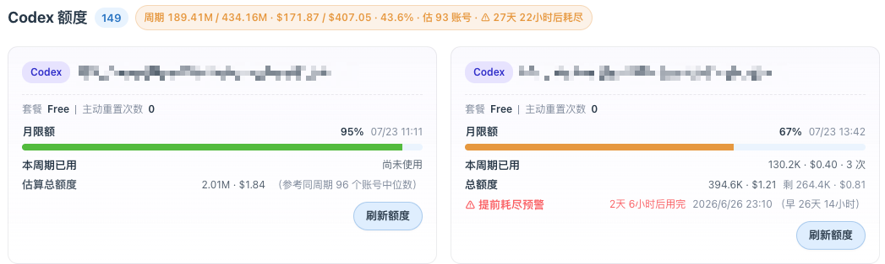

# CPA Codex Helper

> 增强 [CPA-Manager-Plus](https://github.com/seakee/CPA-Manager-Plus) 的 Codex 额度展示：周期用量、总额度反推、剩余额度估算、提前耗尽预警。

简体中文 | [English](./README.md)

一个面向自部署 CPA-Manager-Plus 前端的油猴脚本。脚本不修改任何后端数据，只在浏览器侧复用页面已有的请求与授权信息，为 Codex 额度卡片补充更直观的用量、额度与预测信息。

## 截图

一张页面截图即可看到全部三个修改点：

- **有用量的卡片**（右）：新增「本周期已用」「总额度」「剩余额度」以及提前耗尽预警
- **未使用的卡片**（左）：显示「尚未使用」，并基于同周期账号中位数给出估算总额度
- **区块标题聚合**（标题旁徽章）：合并展示已用 / 总额度的 token 与费用、使用百分比（按 30% / 70% 变色）、估算账号数与耗尽预测时间



## 功能

### 单卡片增强

在每个 Codex 账号卡片中额外展示：

- **本周期已用**：token 数、费用、请求次数（原卡片不提供）
- **总额度**：基于 Codex 返回的已用百分比与 analytics 聚合用量反推
- **剩余额度**：总额度减去已用
- **提前耗尽预警**：按当前消耗速度，预计会早于周期结束时显示警告与预计耗尽时间

### 未使用账号估算

对于本周期尚未消耗的账号：

- **估算总额度**：取同周期窗口下有真实消耗账号的反推额度中位数作为估算
- 估算结果会标注「参考同周期 N 个账号中位数」，便于判断可信度

### 区块标题聚合

在 Codex 区块标题处展示所有账号的合并视图：

- 已用 / 总额度（含估算账号的贡献）
- 使用百分比，按 30% / 70% 阈值变色
- 活跃账号数 + 估算账号数
- 按合并消耗速度预测的耗尽时间（早于周期结束时显示）

### 其他

- **本地缓存**：复用 5 分钟内的 analytics 数据，7 天内的配额信息，减少重复请求
- **自动降级**：CPA-Manager-Plus 实例无 monitoring analytics 端点时自动降级，不破坏原页面
- **多语言**：跟随 CPA-Manager-Plus 当前语言，支持简体中文、繁体中文、英文、俄文

## 安装

### 方式一：从 Greasy Fork 安装（推荐）

从 Greasy Fork 脚本页安装，油猴扩展会自动保持更新。

**[从 Greasy Fork 安装](https://greasyfork.org/zh-CN/scripts/583900-cpa-codex-helper)**

### 方式二：通过 GitHub raw 地址安装

1. 浏览器安装 [Tampermonkey](https://www.tampermonkey.net/) 或 [Violentmonkey](https://violentmonkey.github.io/)
2. 打开脚本安装地址：

   ```
   https://raw.githubusercontent.com/disaeye/CPA-codex-helper/main/CPA-codex-helper.user.js
   ```

3. 在弹出的安装页确认即可

### 方式三：手动粘贴

1. 复制 [`CPA-codex-helper.user.js`](./CPA-codex-helper.user.js) 的全部内容
2. 在油猴扩展中新建脚本，粘贴内容并保存

### 匹配规则

脚本默认匹配任意域名下路径包含 `management.html` 的页面，覆盖自部署 CPA-Manager-Plus 的管理页：

```js
// @match        *://*/*management.html*
// @match        *://*/management.html*
```

按路径而非域名匹配，无需为每个自部署实例手动加规则。若想缩小运行范围，可改成自己的实例域名：

```js
// @match        https://your-cpa-instance.example.com/*management.html*
```

## 使用

打开 CPA-Manager-Plus 管理页后脚本会自动运行。脚本依赖页面自然产生的请求获取数据：

1. 从 CPA-Manager-Plus 请求中捕获授权信息与 API base
2. 从 `auth-files` 响应建立文件名与账号索引的映射
3. 从 Codex usage 响应读取重置时间、周期窗口与已用百分比
4. 调用 CPA-Manager-Plus 的 monitoring analytics 接口聚合周期内用量
5. 将计算结果注入到 Codex 额度卡片和区块标题

页面打开后若没立即出现增强信息，可在 CPA-Manager-Plus 中刷新一次 Codex 额度，让原页面触发相关接口请求。

## 工作原理

### 总额度反推

Codex 返回的 `used_percent` 是基于真实账户状态的已用百分比。配合 CPA-Manager-Plus analytics 聚合出的实际已用 token 数，可直接反推总额度：

```
total_tokens = used_tokens / (used_percent / 100)
```

这比按时间外推更可靠——无论密集使用还是均匀使用，`used_percent` 都反映真实消耗。

### 提前耗尽预测

基于当前周期内的平均消耗速率（token/毫秒），推算剩余额度耗尽时间：

```
remaining_ms = remaining_tokens / consumption_rate
exhaust_at = now + remaining_ms
```

仅当预测耗尽时间早于周期结束时间时才显示预警。

### 未使用账号估算

未消耗账号没有自身用量数据，无法单独反推额度。脚本采用同周期窗口分组的中位数估算：

- 按 `limitWindowSeconds` 把账号分组（月窗口与周窗口不混用）
- 每组取所有「真实有消耗且能反推」账号的反推额度
- 取该组的中位数作为未使用账号的估算额度

中位数而非均值，抗异常值污染。

## 国际化

脚本跟随 CPA-Manager-Plus 的当前语言，支持：

| 语言 | 代码 |
|---|---|
| 简体中文 | `zh-CN` |
| 繁体中文 | `zh-TW` |
| 英文 | `en` |
| 俄文 | `ru` |

语言检测读取自 `document.documentElement.lang` 与 CPA-Manager-Plus 的 localStorage key `cli-proxy-language`，切换页面语言后脚本下次注入即跟随，无需刷新脚本。

## 限制

- 总额度与剩余额度属于估算值，依赖 `used_percent` 与 analytics 聚合数据的准确性
- 提前耗尽预测基于当前周期平均消耗速度，短时间突增突降会影响准确性
- 未使用账号的估算准确度取决于同周期窗口的样本数量；样本越少越不可靠
- 脚本依赖 CPA-Manager-Plus 当前前端 DOM class 名称与接口结构，上游大改后可能需要适配

## 开发

### 仓库结构

```
CPA-codex-helper/
├── CPA-codex-helper.user.js   # 主脚本
├── README.md
├── README.zh-CN.md
├── CHANGELOG.md
├── LICENSE
├── img/                       # 截图
└── .gitignore
```

### 本地调试

1. 克隆仓库
2. 在油猴扩展中新建脚本，粘贴 `CPA-codex-helper.user.js` 内容
3. 保存脚本并刷新 CPA-Manager-Plus 页面

### 发布检查

每次发布前同步更新：

1. `CPA-codex-helper.user.js` 头部的 `@version`
2. [`CHANGELOG.md`](./CHANGELOG.md)
3. README 中如有新增或变更的功能说明

## License

[MIT](./LICENSE)
